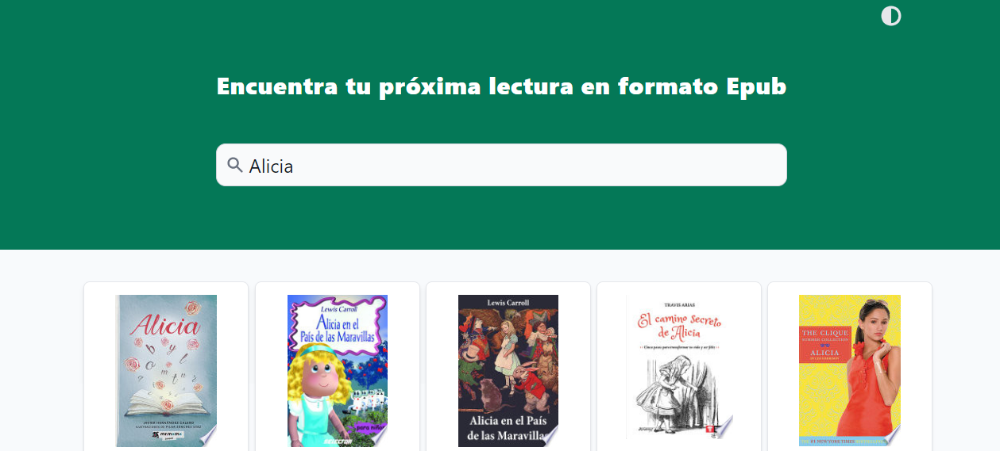

# Web application for epub books search
Version: 1.0.0
Author: Beatriz García
Author URI: https://github.com/TrizBea24

This is an exercise for General Assembly Web Development Course. It was asked to use
a public API and make some unity tests. This exercise is done with React, Tailwind,
HTML and Sass.

## Demo

To check the result of the web page's development, please check the next link: 
https://trizbea24.github.io/books-finder/

## Development

### 1. Structure:

The application has a few components:

- A header with a theme button to change the appearance.
- A search bar.
- A list of results where the books appear.

### 2. Search:

- Firstly the application takes the input written by the user and makes a request to [Google books API](https://developers.google.com/books/docs/v1/using).
- The content provided from the API will appear as a card with an image of the book, a title and a price.

### 3. Book's modal:

Once the book's cards are displayed, the user can click on one of them. Then it will appear a modal with extended information about the book. The layaout will change:

- The background will be one colour depending on the theme.
- The modal will have a desc ription about the book. If the description is too long, the modal will have a scrollbar.
- Users can only close the modal on the X button.

## Application preview

## Install

To use this project you may need to follow the next steps:
- Clone the repo
- Install the dependencies with `npm install`
- Start the project with `npm start`

This project has been developed by **Beatriz García Martín**.
